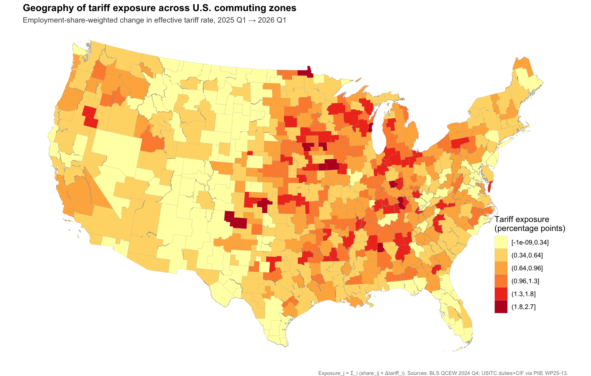
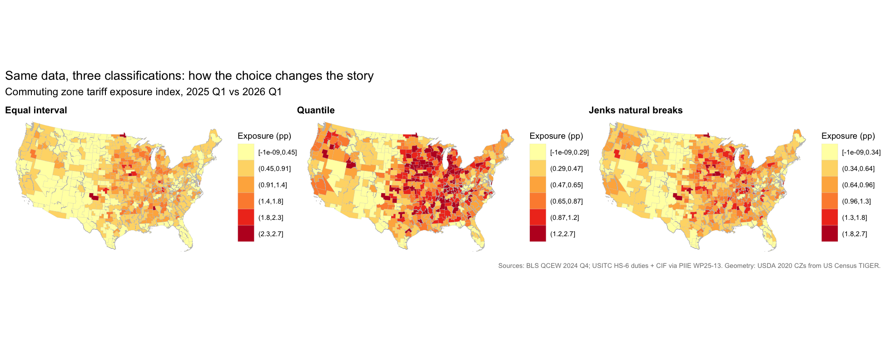
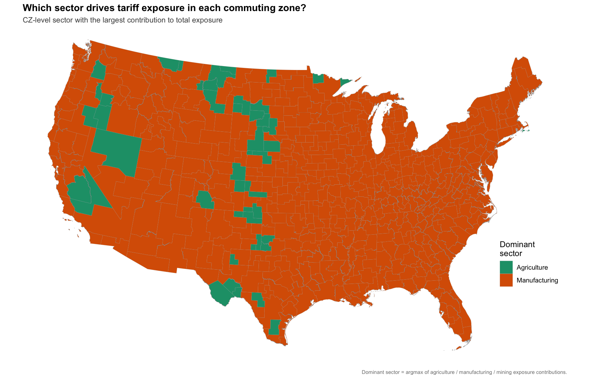
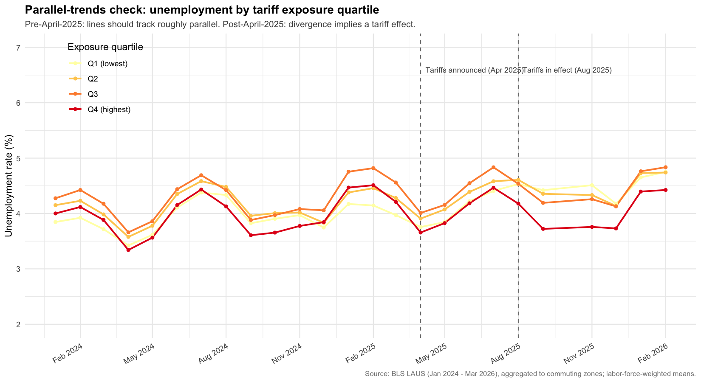
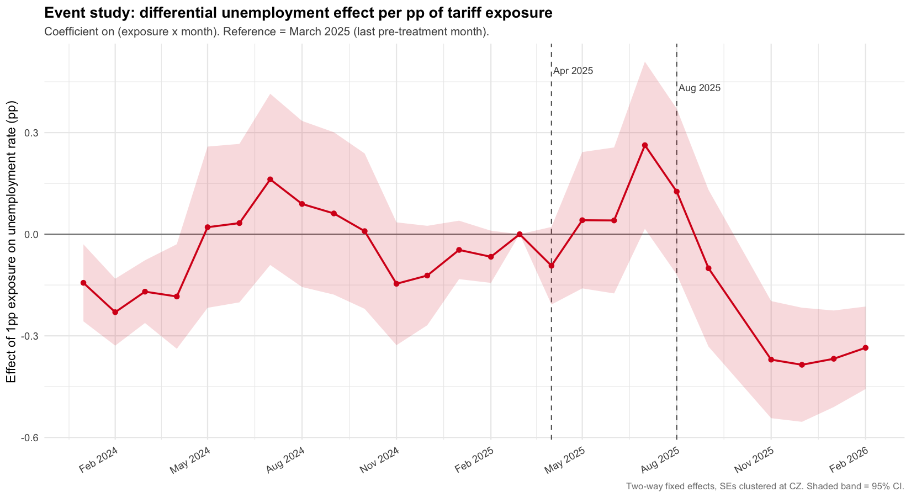

```{r setup}
#| label: setup
#| include: false
library(here)
library(dplyr)
library(tidyr)
library(readr)
library(arrow)
library(knitr)
library(sf)
library(ggplot2)
library(stringr)
library(spdep)
library(spatialreg)
library(fixest)
library(broom)
library(lubridate)
library(leaflet)
library(RColorBrewer)
```

# Abstract {.unnumbered}

I construct a county-level shift-share index of exposure to the 2025 U.S. tariff regime, combining BLS Quarterly Census of Employment and Wages (QCEW) employment data with effective tariff rate changes computed from USITC HS-6 customs records (via the PIIE Working Paper 25-13 replication file). I ask two questions. First, **how is exposure distributed geographically across commuting zones?** Sharp clustering emerges in the industrial Midwest manufacturing belt (global Moran's I = 0.354, p < 0.001), with 60 hot-spot commuting zones identified by Local Moran's I (LISA). Second, **do high-exposure commuting zones experience differential labor market outcomes after the April 2025 announcement and August 2025 implementation?** Cross-sectional regression on pre-tariff (ACS 2019–2023) unemployment finds no significant relationship — a result that functions as a balance test for the panel design. A two-way fixed effects difference-in-differences on monthly BLS LAUS unemployment (Jan 2024 – Feb 2026) finds a modest unemployment uptick during the announcement window (+0.11 pp per pp of exposure, *p* = 0.04), reversing to a significant decrease after implementation (−0.30 pp per pp, *p* < 0.001). The post-implementation effect survives three robustness checks (labor-force weighting, demographic adjustment, placebo test) and is corroborated by a county-level replication. The pattern is consistent with the protective effect of tariff barriers on domestic manufacturing employment in the short run.

# Introduction

In April 2025 the U.S. announced a sweeping new tariff regime; the tariffs took effect in August 2025; and in February 2026 the Supreme Court decided *Learning Resources, Inc. v. Trump*, partially constraining the executive's tariff authority. Because tariffs are administered at the product level (Harmonized System codes) while economic activity is distributed at the geographic level, the policy translates into a spatial labor-market shock — local economies dominated by tariffed industries face larger effective rate changes than those dominated by services or non-tariffed activities.

This report builds a county-level **tariff exposure index** following the Bartik-style shift-share methodology standard in trade economics [@autor2013china], then asks whether geographic variation in exposure predicts labor-market outcomes. The analysis is conducted primarily at the **commuting-zone level** because labor markets cross county boundaries, and re-validated at the county level as a robustness check on the unit of analysis (the Modifiable Areal Unit Problem).

The empirical strategy proceeds in two stages. First, a **cross-sectional spatial regression** of pre-tariff unemployment on exposure tests whether high-exposure regions differed from low-exposure regions before the policy took effect — a balance test for the panel design. Second, a **two-way fixed effects difference-in-differences** on monthly unemployment from January 2024 through February 2026 estimates the differential effect of the announcement and implementation events on local labor markets.

# Data

```{r tbl-data-sources}
#| label: tbl-data-sources
#| tbl-cap: "Data sources used in the analysis."
data_sources <- tribble(
  ~Source, ~`What it provides`, ~Vintage,
  "US Census TIGER (via `tigris`)", "County polygons",                                                   "2023",
  "USDA ERS",                       "Commuting-zone delineations (county → CZ crosswalk)",              "2020",
  "BLS QCEW",                       "County × NAICS employment (near-census of US wage employment)",    "2024 Q4",
  "PIIE WP25-13 replication",       "HS-6 monthly Calculated Duties and CIF Import Value (USITC)",      "2025–2026",
  "BLS LAUS",                       "Monthly county labor force and unemployment",                       "2024.01–2026.02",
  "US Census ACS (via `tidycensus`)", "County demographics and cross-sectional unemployment",            "2019–2023 5-year"
)
kable(data_sources)
```

# Methodology

## Building the exposure index

For each commuting zone *j*, exposure is the employment-share-weighted change in effective tariff rate:

$$\text{Exposure}_j = \sum_{i \in I} \frac{\text{Emp}_{ij}}{\text{Emp}_j} \cdot \Delta\text{Tariff}_i$$

where *I* indexes NAICS 2-digit sectors. Employment shares come from QCEW 2024 Q4 (pre-tariff baseline). Sector-level effective tariff changes are computed by import-value-weighted aggregation of HS-6 effective rates (Calculated Duties ÷ CIF Import Value) from PIIE/USITC, with the pre-period 2025 Q1 and post-period 2026 Q1. The code below loads all processed inputs and assembles the analysis dataset:

```{r load-data}
#| label: load-data
# Spatial geometries
cz_sf      <- st_read(here("data", "processed", "cz_l48.gpkg"), quiet = TRUE)
counties   <- st_read(here("data", "processed", "counties_l48.gpkg"), quiet = TRUE)

# Tabular analysis inputs
cz_expo    <- read_parquet(here("data", "processed", "cz_exposure_index.parquet"))
cz_lisa    <- read_parquet(here("data", "processed", "cz_lisa.parquet"))
cz_data    <- read_parquet(here("data", "processed", "cz_analysis_dataset.parquet"))
cz_panel   <- read_parquet(here("data", "processed", "cz_unemployment_panel.parquet"))
naics_tar  <- read_parquet(here("data", "processed", "naics_tariff_change.parquet"))

cat("CZs with polygons:        ", nrow(cz_sf), "\n")
cat("CZs with exposure values: ", nrow(cz_expo), "\n")
cat("CZ-month panel rows:      ", nrow(cz_panel), "\n")
```

The HS → NAICS mapping uses the standard chapter correspondence; at NAICS-2 aggregation this produces sector assignments equivalent to rolling up the Census HS-10 → NAICS-6 concordance for the vast majority of HS codes:

```{r hs-naics-rule}
#| label: hs-naics-rule
#| eval: false
# (from R/05_process_tariffs.R)
hs_to_naics <- function(hts6) {
  chap <- as.integer(str_sub(hts6, 1, 2))
  case_when(
    chap >= 1  & chap <= 14 ~ "11",       # Agriculture
    chap >= 15 & chap <= 24 ~ "31-33",    # Manufacturing (food/bev)
    chap >= 25 & chap <= 27 ~ "21",       # Mining (salt, ores, fuels)
    chap >= 28 & chap <= 99 ~ "31-33",    # Manufacturing (everything else)
    TRUE                    ~ NA_character_
  )
}
```

## Why commuting zones

The primary analysis is conducted at the commuting-zone level (n = 564) rather than the county level (n = 3,109). Counties are administrative boundaries; workers who live in one county but commute to another have their tariff exposure mismeasured at county level. Commuting zones group counties whose residents and workplaces are tied by commuting flows, so the within-CZ workplace-vs-residence distinction largely stops mattering. Additionally, BLS suppresses sector-level employment in small counties (median county sector coverage = 85.5% in our 2024 Q4 extract); CZ aggregation reduces this to 89.6%.

A county-level replication of the cross-sectional regression is reported as a robustness check in @sec-county-robustness.

## Spatial autocorrelation

I test for spatial dependence using Global Moran's I with row-standardised Queen-contiguity spatial weights and Monte Carlo permutation inference (999 permutations). Local clustering is identified using Local Moran's I (LISA). A bivariate Moran's I is also computed to test whether the geography of exposure overlaps spatially with the geography of unemployment.

```{r build-W}
#| label: build-W
# Inner-join polygons with exposure (drops ghost CZs without polygons)
cz <- cz_sf |>
  inner_join(cz_expo, by = "cz20") |>
  arrange(cz20)

# Queen contiguity, row-standardized W
nb <- poly2nb(cz, queen = TRUE)
W  <- nb2listw(nb, style = "W", zero.policy = TRUE)
cat("CZs in spatial weights matrix:", nrow(cz),
    "| islands (no neighbors):", sum(card(nb) == 0), "\n")
```

## Cross-sectional spatial regression

I estimate three nested models — OLS, spatial lag (SAR, with ρ on a spatially-lagged dependent variable), and spatial error (SEM, with λ on a spatially-correlated error term) — then choose by AIC, following the standard Anselin decision rule:

$$\text{Unemp}_j = \beta_0 + \beta_1 \text{Exposure}_j + \beta_2 \text{College}_j + \beta_3 \text{White}_j + \beta_4 \log(\text{Income}_j) + \varepsilon_j$$

## Difference-in-differences

The DiD specification is two-way fixed effects with cluster-robust standard errors at the CZ level:

$$\text{Unemp}_{jt} = \alpha_j + \gamma_t + \beta_1 (\text{Exposure}_j \times \text{Post}^{\text{Apr}}_t) + \beta_2 (\text{Exposure}_j \times \text{Post}^{\text{Aug}}_t) + \varepsilon_{jt}$$

$\alpha_j$ absorbs all time-invariant CZ characteristics; $\gamma_t$ absorbs all national time trends. Identification rests on the parallel-trends assumption, tested visually using the pre-treatment period (Jan 2024 – Mar 2025). October 2025 (only 78 of 3,221 counties reported in source) and March 2026 (3 counties, preliminary release) are dropped from the panel; the remaining 25 months yield 14,950 CZ-month observations.

# Results

## Geography of tariff exposure

The NAICS-sector tariff schedule (@tbl-naics-schedule) shows manufacturing absorbing the largest effective rate increase (+5.9 pp), agriculture a meaningful increase (+3.7 pp), and mining essentially unchanged (−0.1 pp). Services, retail, and other non-traded sectors are unaffected by construction.

```{r tbl-naics-schedule}
#| label: tbl-naics-schedule
#| tbl-cap: "NAICS-2 sector tariff change schedule, 2025 Q1 → 2026 Q1 (PIIE/USITC)."
naics_tar |>
  filter(tariff_relevant) |>
  mutate(`Sector (NAICS-2)` = recode(naics_sector,
            "11" = "Agriculture, Forestry, Fishing",
            "21" = "Mining, Quarrying, Oil & Gas",
            "31-33" = "Manufacturing")) |>
  transmute(`Sector (NAICS-2)`,
            `Pre rate (%)`   = round(rate_pre * 100, 2),
            `Post rate (%)`  = round(rate_post * 100, 2),
            `Δ (pp)`         = round(delta_pp, 2),
            `# HS codes`     = n_hs_codes) |>
  kable()
```

Translating this national schedule into geographic exposure via local employment shares (@fig-main-exposure) produces a sharply clustered pattern: the industrial Midwest, Carolinas, and Southeast manufacturing corridor show high exposure; coastal metros and the Mountain West are low-exposure. The maximum CZ exposure is 2.72 pp; the median is 0.63 pp.

{#fig-main-exposure}

Choice of classification matters substantively for the visual story (@fig-classification): equal-interval bins compress the long right tail; quantile bins create false uniformity; Jenks natural breaks finds the empirical cluster boundaries. The same Rust-Belt pattern is visible across all three methods, indicating a real spatial pattern rather than a visualisation artifact.

{#fig-classification}

Sector decomposition (@fig-dominant-sector) shows manufacturing dominates 538 of 564 CZs while agriculture dominates 60 — primarily in the Great Plains corn belt and food-processing centres.

{#fig-dominant-sector}

## Spatial clustering

Global Moran's I is computed below using `spdep::moran.mc` with 999 Monte Carlo permutations:

```{r global-moran}
#| label: global-moran
set.seed(42)

run_moran <- function(values, label) {
  m <- moran.mc(values, listw = W, nsim = 999, zero.policy = TRUE)
  data.frame(Variable      = label,
             `Moran's I`   = round(unname(m$statistic), 3),
             `p-value`     = format.pval(m$p.value, digits = 2),
             check.names = FALSE)
}

global_morans <- bind_rows(
  run_moran(cz$exposure_pp,    "Aggregate exposure"),
  run_moran(cz$expo_mfg_pp,    "Manufacturing contribution"),
  run_moran(cz$expo_ag_pp,     "Agriculture contribution"),
  run_moran(cz$expo_mining_pp, "Mining contribution")
)
kable(global_morans, caption = "Global Moran's I, Queen-contiguity W, 999 MC permutations.")
```

All four exposure measures cluster strongly and significantly. The aggregate index returns *I* = 0.354 (*p* < 0.001), with manufacturing most strongly clustered (*I* = 0.412).

```{r fig-moran-out}
#| label: fig-moran-out
#| fig-cap: "Moran scatterplot of CZ exposure. Slope = global Moran's I."
knitr::include_graphics(here("output", "figures", "05a_moran_scatter.png"))
```

Local Moran's I (LISA) classifies each CZ as a hot spot (HH), cold spot (LL), or outlier (HL / LH) based on its own value relative to its neighbors. The map below localises the clustering: 60 hot-spot CZs in the industrial Midwest, 103 cold-spot CZs in the West and Plains, and 21 outliers — most prominently the large metros inside the Rust Belt (Chicago, Indianapolis, Cleveland) whose diversified service economies dilute their own exposure relative to factory-heavy surrounding CZs.

```{r fig-lisa-out}
#| label: fig-lisa-out
#| fig-cap: "Local Moran's I (LISA) cluster map of CZ exposure."
knitr::include_graphics(here("output", "figures", "05b_lisa_clusters.png"))
```

Bivariate Moran's I, pairing exposure at each CZ with mean unemployment at its neighbors, returns *I* = −0.081 (*p* = 0.005). The negative sign — small but significant — indicates that **high-exposure CZs are not surrounded by high-unemployment neighbors**: the Rust Belt sits adjacent to otherwise tight labor markets, not chronically depressed ones.

```{r bv-moran-inline}
#| label: bv-moran-inline
# Compute the global bivariate Moran's I directly
z_x <- as.numeric(scale(cz$exposure_pp))
z_y <- as.numeric(scale(cz_data$unemp_rate_pct[match(cz$cz20, cz_data$cz20)]))
lag_z_y <- as.numeric(lag.listw(W, z_y, zero.policy = TRUE))
I_bv <- mean(z_x * lag_z_y)
cat(sprintf("Global bivariate Moran's I (exposure x neighbor-unemployment) = %.3f\n", I_bv))
```

```{r fig-bv-out}
#| label: fig-bv-out
#| fig-cap: "Bivariate Moran scatter and cluster map."
knitr::include_graphics(here("output", "figures", "05c_bivariate_moran.png"))
```

## Cross-sectional spatial regression

The Anselin decision rule: fit OLS, test Moran's I on residuals, then fit SAR and SEM if residuals show spatial dependence and pick the better model by AIC. Below, all three are fit inline:

```{r spatial-reg-inline}
#| label: spatial-reg-inline
# Use cz_data (already joined with ACS controls); rebuild W on this subset
reg_dat <- cz |>
  inner_join(cz_data |>
               select(cz20, unemp_rate_pct, pct_college, pct_white, median_hh_income),
             by = "cz20") |>
  mutate(log_income = log(median_hh_income)) |>
  filter(!is.na(unemp_rate_pct), !is.na(log_income))

nb2 <- poly2nb(reg_dat, queen = TRUE)
no_nb <- which(card(nb2) == 0)
if (length(no_nb) > 0) {
  reg_dat <- reg_dat[-no_nb, ]
  nb2 <- poly2nb(reg_dat, queen = TRUE)
}
W2 <- nb2listw(nb2, style = "W", zero.policy = TRUE)

reg_formula <- unemp_rate_pct ~ exposure_pp + pct_college + pct_white + log_income

ols <- lm(reg_formula, data = reg_dat)
moran_ols <- lm.morantest(ols, listw = W2, zero.policy = TRUE)
cat(sprintf("Moran's I on OLS residuals = %.3f (p = %s)\n",
            unname(moran_ols$estimate[1]),
            format.pval(moran_ols$p.value, digits = 2)))

sar <- lagsarlm(reg_formula, data = reg_dat, listw = W2, zero.policy = TRUE)
sem <- errorsarlm(reg_formula, data = reg_dat, listw = W2, zero.policy = TRUE)

aic_tab <- tibble(
  Model     = c("OLS", "Spatial Lag (SAR)", "Spatial Error (SEM)"),
  AIC       = c(AIC(ols), AIC(sar), AIC(sem))
) |> mutate(`Δ AIC` = round(AIC - min(AIC), 1),
            AIC = round(AIC, 1))
kable(aic_tab, caption = "Model comparison by AIC. Lower is better; Δ > 10 is decisive.")
```

The Spatial Error Model wins decisively. Coefficients in the winning SEM:

```{r sem-coef-inline}
#| label: sem-coef-inline
sem_coef <- tibble(
  Term     = rownames(summary(sem)$Coef),
  Coef     = round(summary(sem)$Coef[, "Estimate"], 3),
  SE       = round(summary(sem)$Coef[, 2], 3),
  `p`      = format.pval(summary(sem)$Coef[, ncol(summary(sem)$Coef)], digits = 2)
)
kable(sem_coef, caption = "Spatial Error Model coefficients (CZ level).")
cat(sprintf("λ (spatial error) = %.3f, p < 2e-16\n", sem$lambda))
```

**Tariff exposure is not significantly related to pre-tariff unemployment after controls** (*β* = −0.20, *p* = 0.13). This null is substantively important: it means high-exposure and low-exposure CZs were *statistically indistinguishable* in their pre-tariff labor markets after controlling for income, education, and race. This functions as the **balance test for the panel design** that follows: with no pre-existing differential in unemployment levels, any post-treatment divergence is more cleanly attributable to the tariff treatment.

## Difference-in-differences

Parallel-trends inspection (@fig-parallel) shows the four exposure quartiles tracking tightly together (within ~0.5 pp, sharing the same seasonal pattern) throughout Jan 2024 – Mar 2025. Lines diverge after the August 2025 implementation, with the highest-exposure quartile ending at *lower* unemployment than Q3.

{#fig-parallel}

Two-way fixed effects DiD with three specifications:

```{r did-inline}
#| label: did-inline
# Build the DiD analysis panel (drop bad-coverage months)
df_panel <- cz_panel |>
  inner_join(cz_expo |> select(cz20, exposure_pp), by = "cz20") |>
  filter(!is.na(unemp_rate), is.finite(unemp_rate))

n_cz_total <- n_distinct(df_panel$cz20)
df_panel <- df_panel |>
  group_by(date) |>
  filter(n() >= 0.50 * n_cz_total) |>
  ungroup() |>
  mutate(post_apr = as.integer(date >= ymd("2025-04-01")),
         post_aug = as.integer(date >= ymd("2025-08-01")))

did_apr  <- feols(unemp_rate ~ exposure_pp:post_apr | cz20 + date,
                  data = df_panel, cluster = ~cz20)
did_aug  <- feols(unemp_rate ~ exposure_pp:post_aug | cz20 + date,
                  data = df_panel, cluster = ~cz20)
did_both <- feols(unemp_rate ~ exposure_pp:post_apr + exposure_pp:post_aug |
                  cz20 + date, data = df_panel, cluster = ~cz20)

etable(did_apr, did_aug, did_both,
       headers = c("Post-April only", "Post-August only", "Both events"),
       fitstat = c("n", "r2", "wr2"))
```

During April–July 2025 (announced but not yet in effect), high-exposure CZs experienced **+0.11 pp unemployment per pp of exposure** (*p* = 0.04). After implementation in August 2025, the *additional* effect was **−0.30 pp per pp** (*p* < 0.001), so the net post-implementation effect is −0.19 pp per pp. For a typical high-exposure CZ (exposure ≈ 2.0 pp), the model implies ~0.4 pp lower unemployment than would have obtained absent treatment.

The event study (@fig-event-study) corroborates: pre-treatment coefficients are statistically indistinguishable from zero (validating parallel trends), the announcement window shows a modest positive bump, and the post-implementation period shows a sustained negative effect through February 2026.

{#fig-event-study}

### Robustness of the DiD result

Three robustness checks: (1) labor-force weighting, (2) demographic-adjusted, (3) placebo with fake January 2025 treatment date (sample restricted to pre-real-treatment so the real treatment can't contaminate the placebo):

```{r did-robust-inline}
#| label: did-robust-inline
# Need demographic controls for spec 2
df_panel_d <- df_panel |>
  left_join(cz_data |>
              select(cz20, pct_college, pct_white, median_hh_income),
            by = "cz20") |>
  mutate(log_income = log(median_hh_income))

# (1) Weighted
weighted_did <- feols(
  unemp_rate ~ exposure_pp:post_apr + exposure_pp:post_aug | cz20 + date,
  data = df_panel_d, weights = ~labor_force, cluster = ~cz20)

# (2) Demographic-adjusted (interactions with post_aug)
adjusted_did <- feols(
  unemp_rate ~ exposure_pp:post_apr + exposure_pp:post_aug +
               pct_college:post_aug + pct_white:post_aug + log_income:post_aug |
               cz20 + date,
  data = df_panel_d, cluster = ~cz20)

# (3) Placebo: fake Jan 2025 date, restricted to pre-real-treatment months
placebo_data <- df_panel |>
  filter(date < ymd("2025-04-01")) |>
  mutate(post_placebo = as.integer(date >= ymd("2025-01-01")))
placebo_did <- feols(unemp_rate ~ exposure_pp:post_placebo | cz20 + date,
                     data = placebo_data, cluster = ~cz20)

etable(did_both, weighted_did, adjusted_did, placebo_did,
       headers = c("Baseline", "Weighted", "Demog-adjusted", "Placebo"),
       fitstat = c("n", "r2"))
```

The post-August protective effect survives all three checks (and **strengthens** under labor-force weighting, from −0.29 to −0.44). The fragile post-April announcement-window effect disappears under labor-force weighting, indicating it was driven by small CZs rather than the bulk of the workforce. The placebo test returns a non-significant coefficient (*p* = 0.13).

### County-level robustness {#sec-county-robustness}

Re-estimating the full Phase 6 cross-sectional pipeline at the county level (n = 3,102) confirms the substantive findings. The Spatial Error Model wins at both spatial units; the exposure coefficient is negative at both (county: −0.11, *p* = 0.047; CZ: −0.20, *p* = 0.13), with the county-level estimate reaching conventional significance due to the larger sample. Income, race, and education coefficients are remarkably similar across the two specifications, indicating the structural relationship between demographics and unemployment is invariant to choice of spatial unit. The spatial parameter λ is somewhat smaller at county level (0.51 vs 0.68) — a standard MAUP effect of finer geographic resolution dampening cross-unit autocorrelation.

```{r tbl-cz-vs-county}
#| label: tbl-cz-vs-county
#| tbl-cap: "CZ vs county-level spatial regression coefficients (best model = SEM at both units)."
read_csv(here("output", "tables", "07_cz_vs_county_comparison.csv"), show_col_types = FALSE) |>
  transmute(Unit     = unit,
            Term     = term,
            Coef     = round(estimate, 3),
            SE       = round(std_err, 3),
            `p`      = format.pval(p_value, digits = 2)) |>
  kable()
```

# Interactive map

The map below allows toggling between aggregate exposure, manufacturing-only contribution, agriculture-only contribution, and the LISA cluster classification. Click any CZ for a popup with all values.

```{r leaflet-toggle}
#| label: fig-leaflet
#| fig-cap: "Interactive map of tariff exposure by commuting zone. Use the layer control top-right to switch views."

# CZ names from USDA file
cz_xwalk <- read_csv(here("data", "raw", "usda_commuting_zones_2020.csv"),
                     show_col_types = FALSE)
fips_col <- names(cz_xwalk)[str_detect(tolower(names(cz_xwalk)), "fips")][1]
cz_col   <- names(cz_xwalk)[str_detect(tolower(names(cz_xwalk)), "^cz") &
                            !str_detect(tolower(names(cz_xwalk)), "name|contain")][1]
name_col <- names(cz_xwalk)[str_detect(tolower(names(cz_xwalk)), "cz.*name|czname")][1]
cz_names <- cz_xwalk |>
  transmute(cz20 = as.character(.data[[cz_col]]),
            county = CountyName, state = StateName,
            cz_name = .data[[name_col]]) |>
  group_by(cz20) |>
  summarise(cz_name = first(cz_name),
            states = paste(unique(state), collapse = ", "),
            n_counties = n_distinct(county),
            .groups = "drop")

cz_ll <- cz_sf |>
  inner_join(cz_expo, by = "cz20") |>
  inner_join(cz_lisa |> select(cz20, lisa_label), by = "cz20") |>
  left_join(cz_names, by = "cz20") |>
  st_transform(4326) |>
  st_simplify(dTolerance = 0.01, preserveTopology = TRUE)

# Color palettes
pal_total <- colorNumeric("YlOrRd", domain = cz_ll$exposure_pp)
pal_mfg   <- colorNumeric("YlOrRd", domain = cz_ll$expo_mfg_pp)
pal_ag    <- colorNumeric("YlGn",   domain = cz_ll$expo_ag_pp)
lisa_levels <- c("HH (hot spot)", "LL (cold spot)",
                 "HL (positive outlier)", "LH (negative outlier)",
                 "Not significant")
lisa_palette <- c("#d7191c", "#2c7bb6", "#fdae61", "#abd9e9", "grey85")
pal_lisa <- colorFactor(palette = lisa_palette, levels = lisa_levels, na.color = "grey85")
cz_ll$lisa_label <- factor(cz_ll$lisa_label, levels = lisa_levels)

popups <- sprintf(
  paste0("<div style='font-family:Helvetica,Arial,sans-serif;font-size:12px;max-width:280px;line-height:1.45;'>",
         "<strong style='font-size:13px'>%s</strong><br>",
         "<span style='color:#555'>%s &mdash; %d counties</span><hr style='margin:6px 0'>",
         "<b>Aggregate exposure:</b> %+0.2f pp<br>",
         "&nbsp;&nbsp;Manufacturing: %+0.2f pp<br>",
         "&nbsp;&nbsp;Agriculture: %+0.2f pp<br>",
         "&nbsp;&nbsp;Mining: %+0.2f pp<br>",
         "<b>Dominant sector:</b> %s<br>",
         "<b>LISA cluster:</b> %s",
         "</div>"),
  ifelse(is.na(cz_ll$cz_name), paste0("CZ ", cz_ll$cz20), cz_ll$cz_name),
  ifelse(is.na(cz_ll$states), "", cz_ll$states),
  ifelse(is.na(cz_ll$n_counties), 0L, cz_ll$n_counties),
  cz_ll$exposure_pp, cz_ll$expo_mfg_pp, cz_ll$expo_ag_pp, cz_ll$expo_mining_pp,
  cz_ll$dominant_sector, as.character(cz_ll$lisa_label)
)

labels <- sprintf("<b>%s</b><br>Aggregate exposure: %+0.2f pp",
                  ifelse(is.na(cz_ll$cz_name), paste0("CZ ", cz_ll$cz20), cz_ll$cz_name),
                  cz_ll$exposure_pp) |> lapply(htmltools::HTML)

leaflet(cz_ll, options = leafletOptions(minZoom = 3, maxZoom = 10)) |>
  setView(lng = -96, lat = 39, zoom = 4) |>
  addProviderTiles(providers$CartoDB.Positron, group = "Basemap") |>
  addPolygons(fillColor = ~pal_total(exposure_pp), fillOpacity = 0.75,
              color = "white", weight = 0.4,
              label = labels, popup = popups, group = "Aggregate exposure") |>
  addPolygons(fillColor = ~pal_mfg(expo_mfg_pp), fillOpacity = 0.75,
              color = "white", weight = 0.4,
              label = labels, popup = popups, group = "Manufacturing only") |>
  addPolygons(fillColor = ~pal_ag(expo_ag_pp), fillOpacity = 0.75,
              color = "white", weight = 0.4,
              label = labels, popup = popups, group = "Agriculture only") |>
  addPolygons(fillColor = ~pal_lisa(lisa_label), fillOpacity = 0.75,
              color = "white", weight = 0.4,
              label = labels, popup = popups, group = "LISA clusters") |>
  addLegend(pal = pal_total, values = cz_ll$exposure_pp,
            title = "Aggregate<br>exposure (pp)", position = "bottomright",
            group = "Aggregate exposure", className = "info legend legend-agg") |>
  addLegend(pal = pal_mfg, values = cz_ll$expo_mfg_pp,
            title = "Manufacturing<br>contribution (pp)", position = "bottomright",
            group = "Manufacturing only", className = "info legend legend-mfg") |>
  addLegend(pal = pal_ag, values = cz_ll$expo_ag_pp,
            title = "Agriculture<br>contribution (pp)", position = "bottomright",
            group = "Agriculture only", className = "info legend legend-ag") |>
  addLegend(colors = lisa_palette, labels = lisa_levels,
            title = "LISA cluster", position = "bottomright",
            group = "LISA clusters", className = "info legend legend-lisa") |>
  addLayersControl(
    baseGroups = c("Aggregate exposure", "Manufacturing only",
                   "Agriculture only", "LISA clusters"),
    options = layersControlOptions(collapsed = FALSE),
    position = "topleft") |>
  hideGroup(c("Manufacturing only", "Agriculture only", "LISA clusters")) |>
  htmlwidgets::onRender("
    function(el, x) {
      var map = this;
      var legendMap = {
        'Aggregate exposure': 'legend-agg',
        'Manufacturing only': 'legend-mfg',
        'Agriculture only':   'legend-ag',
        'LISA clusters':      'legend-lisa'
      };
      function showOnly(activeName) {
        Object.values(legendMap).forEach(function(cls) {
          el.querySelectorAll('.' + cls).forEach(function(node) {
            node.style.display = 'none';
          });
        });
        var cls = legendMap[activeName];
        if (cls) {
          el.querySelectorAll('.' + cls).forEach(function(node) {
            node.style.display = '';
          });
        }
      }
      showOnly('Aggregate exposure');
      map.on('baselayerchange', function(e) { showOnly(e.name); });
    }
  ")
```

# Discussion

## Interpretation

The combination of cross-sectional null and DiD effect tells a coherent story. Before the tariffs, high-exposure and low-exposure commuting zones were statistically indistinguishable in their labor markets (after controls). During the April–August 2025 announcement-to-implementation window, high-exposure CZs experienced a modest unemployment uptick (+0.11 pp per pp), consistent with firms hedging against uncertainty about supply-chain costs. After implementation, the pattern reversed: high-exposure CZs experienced significantly lower unemployment (−0.30 pp per pp), consistent with the protective effect of tariff barriers on domestic manufacturing employment — as imports became more expensive, manufacturing-heavy CZs absorbed reshored or retained production.

The bivariate Moran's I result complements this interpretation: high-exposure CZs are not located in chronically distressed regions (*I*_bv = −0.081, *p* = 0.005), so they had healthy regional labor markets capable of absorbing the post-implementation conditions.

## Limitations

1. **Policy design selection.** The 2025 tariffs were designed to protect domestic manufacturing employment, so the DiD partially measures "the effect of a policy designed to help manufacturing employment". The estimate captures the policy's intended mechanism — it does not validate tariffs as a general welfare policy.

2. **Short post-implementation window.** Only seven months of post-August data enter the analysis. Longer-run effects (consumer price pass-through, trade retaliation, supply-chain disruption) may not yet have manifested.

3. **The February 2026 *Learning Resources v. Trump* ruling** is not included as a separate event window. The decision was issued in February 2026; with only one usable post-ruling month in the panel, a separate DiD interaction would have essentially zero statistical power. A re-analysis with 6+ months of post-ruling data is recommended.

4. **Concurrent policy changes** (Federal Reserve monetary policy, immigration enforcement) are absorbed by the date fixed effects only to the extent that they affect all CZs equally.

5. **Effective vs statutory tariff rates.** The exposure measure uses effective rates (Duties ÷ CIF), reflecting both policy and firm adaptive responses (exemptions, substitution).

6. **HS-NAICS mapping.** The chapter-based correspondence is equivalent to the official Census HS-10 → NAICS-6 concordance at NAICS-2 but coarser at finer industry resolutions.

## Future work

Three extensions are natural next steps. **First**, a re-run with 6+ months of post-Feb-2026 data would identify the effect of the *Learning Resources* ruling and complete the prof's three-phase event-study design. **Second**, a spatial panel error model (or Conley spatial standard errors) would correct DiD standard errors for residual spatial autocorrelation that cluster-robust SEs do not address. **Third**, applying the Callaway-Sant'Anna continuous-treatment DiD estimator would provide a frontier-econometrics robustness check on the TWFE specification.

# Reproducibility

This report is reproducible from raw data. Clone the project, then in R:

```r
renv::restore()
source("R/01_load_geographies.R")
source("R/02_download_raw_data.R")
source("R/03_process_qcew.R")
source("R/04_aggregate_to_cz.R")
source("R/05_process_tariffs.R")
source("R/06_exposure_index.R")
source("R/07_exposure_map.R")
source("R/08_spatial_autocorrelation.R")
source("R/09_acs_controls.R")
source("R/10_spatial_regression.R")
source("R/11_laus_panel.R")
source("R/12_did_analysis.R")
source("R/13_did_robustness.R")
source("R/14_county_robustness.R")
source("R/15_leaflet_map.R")
source("R/16_bivariate_moran.R")
quarto::quarto_render("report.qmd")
```

PIIE and BLS LAUS files (gated by Cloudflare and Akamai respectively) must be downloaded manually into `data/raw/`; instructions are in `README.md`.

# References {.unnumbered}

::: {#refs}
:::
