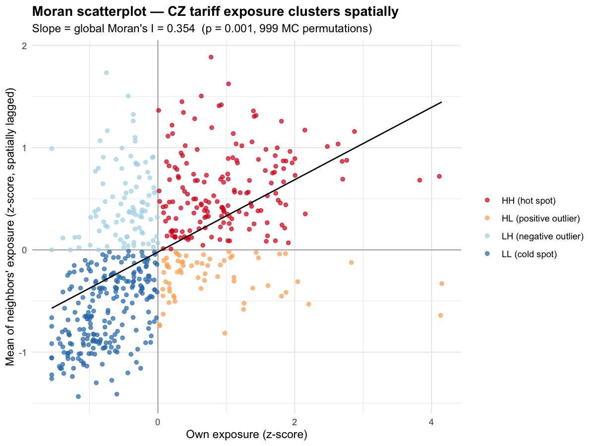
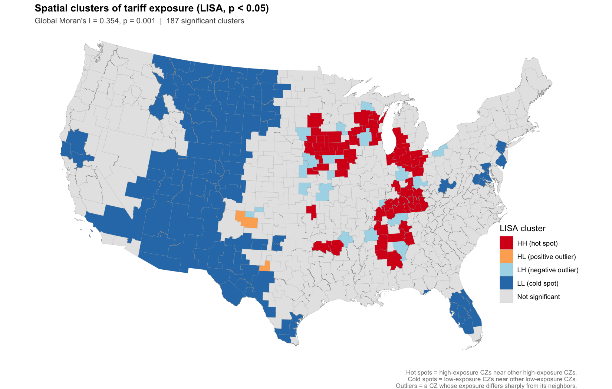
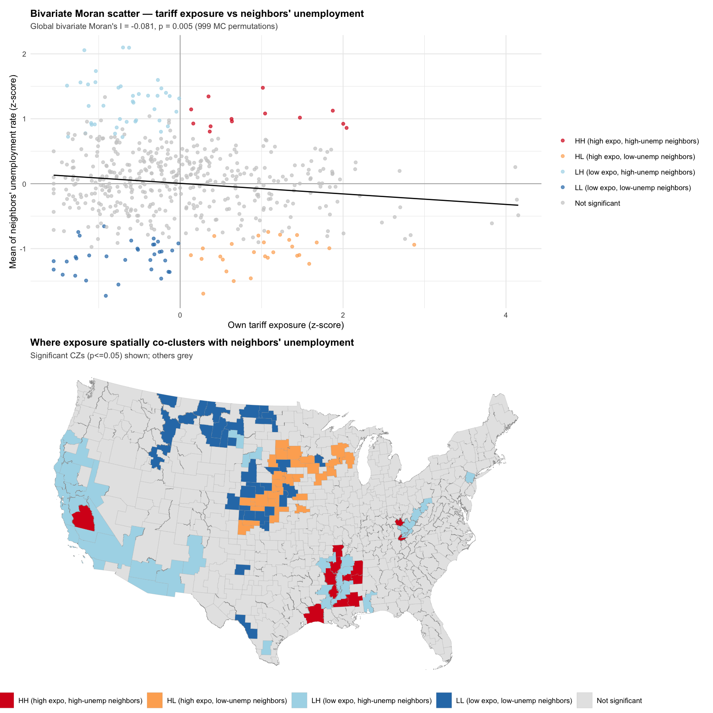

```{r setup}
#| include: false
library(here)
library(dplyr)
library(readr)
library(arrow)
library(knitr)
library(sf)
library(ggplot2)
```

# Abstract {.unnumbered}

I construct a county-level shift-share index of exposure to the 2025 U.S. tariff regime, combining BLS Quarterly Census of Employment and Wages (QCEW) employment data with effective tariff rate changes computed from USITC HS-6 customs records (via the PIIE Working Paper 25-13 replication file). I then ask two questions. First, **how is exposure distributed geographically across commuting zones?** I find sharp clustering in the industrial Midwest manufacturing belt (global Moran's I = 0.354, p < 0.001), with 60 hot-spot commuting zones identified by local Moran's I (LISA). Second, **do high-exposure commuting zones experience differential labor market outcomes after the April 2025 announcement and August 2025 implementation?** Cross-sectional regression on pre-tariff (ACS 2019–2023) unemployment finds no significant relationship — a result I interpret as a balance test for the panel design that follows. A two-way fixed effects difference-in-differences (BLS LAUS 2024 Jan – 2026 Feb) finds a **modest unemployment uptick during the announcement window** (+0.11 pp per pp of exposure, *p* = 0.04), reversing to a **significant decrease after implementation** (−0.30 pp per pp, *p* < 0.001). The post-implementation effect survives three robustness checks (labor-force weighting, demographic adjustment, placebo test) and is corroborated by a county-level replication of the cross-sectional regression. The pattern is consistent with the protective effect of tariff barriers on domestic manufacturing employment in the short run.

# Introduction

In April 2025 the U.S. announced a sweeping new tariff regime; the tariffs took effect in August 2025; and in February 2026 the Supreme Court decided *Learning Resources, Inc. v. Trump*, partially constraining the executive's tariff authority. Because tariffs are administered at the product level (Harmonized System codes) while economic activity is distributed at the geographic level, the policy translates into a spatial labor-market shock — local economies dominated by tariffed industries face larger effective rate changes than those dominated by services or non-tariffed activities.

This report builds a county-level **tariff exposure index** following the Bartik-style shift-share methodology standard in trade economics [@autor2013china], then asks whether geographic variation in exposure predicts labor-market outcomes. The analysis is conducted primarily at the **commuting-zone level** because labor markets cross county boundaries, and re-validated at the county level as a sensitivity check on the unit of analysis (the Modifiable Areal Unit Problem).

The empirical strategy proceeds in two stages. First, a **cross-sectional spatial regression** of pre-tariff unemployment on exposure tests whether high-exposure regions differed from low-exposure regions before the policy took effect — a balance test for the panel design. Second, a **two-way fixed effects difference-in-differences** on monthly unemployment from January 2024 through February 2026 estimates the causal effect of the announcement and implementation events on local labor markets.

# Data

```{r tab-data-sources}
#| label: tbl-data-sources
#| tbl-cap: "Data sources used in the analysis."
data_sources <- tribble(
  ~Source, ~`What it provides`, ~Vintage, ~`Used in`,
  "US Census TIGER (via `tigris`)", "County polygons",                                                   "2023",       "Phase 1",
  "USDA ERS",                       "Commuting-zone delineations (county → CZ crosswalk)",              "2020",       "Phase 2",
  "BLS QCEW",                       "County × NAICS employment (near-census of US wage employment)",    "2024 Q4",    "Phase 2",
  "PIIE WP25-13 replication",       "HS-6 monthly Calculated Duties and CIF Import Value (USITC)",      "2025–2026",  "Phase 2",
  "BLS LAUS",                       "Monthly county labor force and unemployment",                       "2024.01–2026.02", "Phase 6.5",
  "US Census ACS (via `tidycensus`)", "County demographics (income, education, race) and cross-sectional unemployment", "2019–2023 5-year", "Phase 5.5"
)
kable(data_sources)
```

# Methodology

## The exposure index

For each commuting zone *j*, exposure is computed as the employment-share-weighted change in effective tariff rate:

$$\text{Exposure}_j = \sum_{i \in I} \frac{\text{Emp}_{ij}}{\text{Emp}_j} \cdot \Delta\text{Tariff}_i$$

where *I* indexes NAICS 2-digit sectors. Employment shares come from QCEW 2024 Q4 (the pre-tariff baseline). Sector-level effective tariff changes are computed by import-value-weighted aggregation of HS-6 effective rates (Calculated Duties ÷ CIF Import Value) from PIIE/USITC. The pre-period is 2025 Q1; the post-period is 2026 Q1. This is the canonical Bartik shift-share decomposition: geographic variation comes from local employment mix; the tariff schedule is the national shock.

To map HS-6 imports to NAICS sectors I use the standard HS-chapter correspondence (HS 01–14 = Agriculture, 15–24 = Manufacturing-food, 25–27 = Mining, 28–99 = Manufacturing). At the NAICS-2 sector aggregation used here, this produces sector assignments equivalent to rolling up the Census HS-10 → NAICS-6 concordance for the overwhelming majority of HS codes. A more granular HS-10 mapping is a planned refinement for industry-level disaggregation.

## Why commuting zones

The primary analysis is conducted at the commuting-zone level (n = 564) rather than the county level (n = 3,109). Counties are administrative boundaries drawn for governance, not economic logic; workers who live in one county but commute to another have their tariff exposure mismeasured at county level. Commuting zones group counties whose residents and workplaces are tied by commuting flows, so the within-CZ workplace-vs-residence distinction largely stops mattering. Additionally, BLS suppresses sector-level employment in small counties (median county sector coverage = 85.5% in our 2024 Q4 extract); CZ aggregation reduces this to 89.6%.

A county-level replication of the cross-sectional regression is reported as a robustness check (Section @sec-county-robustness).

## Spatial autocorrelation diagnostics

Before estimating spatial regressions I test for spatial dependence using **Global Moran's I** with row-standardised Queen-contiguity spatial weights and Monte Carlo permutation inference (999 permutations). Local clustering is then identified using **Local Moran's I (LISA)**, with each CZ classified as high-high, low-low, high-low, or low-high based on its own value relative to its neighbors' values. A **bivariate Moran's I** statistic is also computed to test whether the geography of exposure overlaps spatially with the geography of unemployment.

## Cross-sectional spatial regression

I estimate three nested models: ordinary least squares; spatial lag (SAR, with $\rho$ on the spatially-lagged dependent variable); and spatial error (SEM, with $\lambda$ on the spatially-correlated error). The best model is chosen by AIC, following the standard Anselin decision rule. The regression specification is:

$$\text{Unemp}_j = \beta_0 + \beta_1 \text{Exposure}_j + \beta_2 \text{College}_j + \beta_3 \text{White}_j + \beta_4 \log(\text{Income}_j) + \varepsilon_j$$

Demographic controls come from the ACS 5-year 2019–2023 (county estimates aggregated to commuting zones, with rate variables recomputed from raw counts and median income population-weighted).

## Difference-in-differences

The DiD specification is two-way fixed effects with cluster-robust standard errors at the CZ level:

$$\text{Unemp}_{jt} = \alpha_j + \gamma_t + \beta_1 (\text{Exposure}_j \times \text{Post}^{\text{Apr}}_t) + \beta_2 (\text{Exposure}_j \times \text{Post}^{\text{Aug}}_t) + \varepsilon_{jt}$$

$\alpha_j$ absorbs all time-invariant CZ characteristics; $\gamma_t$ absorbs all national time trends. Identification rests on the parallel-trends assumption, tested visually using the pre-treatment period (Jan 2024 – Mar 2025).

The DiD outcome (monthly LAUS unemployment) covers Jan 2024 – Feb 2026. October 2025 is dropped from the panel (BLS reported only 78 of 3,221 counties for that month, a real data gap in the source). March 2026 is also dropped (only 3 counties reported, preliminary release). The remaining 25 months yield 14,950 CZ-month observations.

# Results

## Geography of tariff exposure

The NAICS-sector tariff schedule (@tbl-naics-schedule) shows manufacturing absorbing the largest effective rate increase (+5.9 pp), agriculture a meaningful increase (+3.7 pp), and mining essentially unchanged (−0.1 pp, consistent with reported steel/aluminum exemptions). Services, retail, and other non-traded sectors are unaffected by construction.

```{r tbl-naics-schedule}
#| label: tbl-naics-schedule
#| tbl-cap: "NAICS-2 sector tariff change schedule, 2025 Q1 → 2026 Q1 (PIIE/USITC)."
read_parquet(here("data", "processed", "naics_tariff_change.parquet")) |>
  filter(tariff_relevant) |>
  mutate(`Sector (NAICS-2)` = recode(naics_sector,
            "11" = "Agriculture, Forestry, Fishing",
            "21" = "Mining, Quarrying, Oil & Gas",
            "31-33" = "Manufacturing")) |>
  transmute(`Sector (NAICS-2)`,
            `Pre rate (%)`   = round(rate_pre * 100, 2),
            `Post rate (%)`  = round(rate_post * 100, 2),
            `Δ (pp)`         = round(delta_pp, 2),
            `# HS codes`     = n_hs_codes) |>
  kable()
```

Translating this national schedule into geographic exposure via local employment shares (@fig-main-exposure) produces a sharply clustered pattern: the industrial Midwest, Carolinas, and Southeast manufacturing corridor show high exposure; coastal metros and the Mountain West are low-exposure. The maximum CZ exposure is 2.72 pp; the median is 0.63 pp.

{#fig-main-exposure}

Choice of classification matters substantively for the visual story (@fig-classification): equal-interval bins compress the long right tail into a single low-value class; quantile bins create false uniformity by construction; Jenks natural breaks finds the empirical cluster boundaries. The same Rust-Belt pattern is visible across all three methods, indicating a real spatial pattern rather than a visualisation artifact.

{#fig-classification}

Sector decomposition (@fig-dominant-sector) shows that manufacturing dominates 538 of 564 CZs while agriculture dominates 60 — primarily in the Great Plains corn belt and food-processing centres. No CZ is mining-dominated.

{#fig-dominant-sector}

## Spatial clustering

Global Moran's I confirms strong positive spatial autocorrelation in exposure (@tbl-moran-global): the aggregate index returns *I* = 0.354 (*p* < 0.001), with the manufacturing contribution most strongly clustered (*I* = 0.412).

```{r tbl-moran-global}
#| label: tbl-moran-global
#| tbl-cap: "Global Moran's I for tariff exposure, Queen-contiguity W, 999 Monte Carlo permutations."
read_csv(here("output", "tables", "05_moran_global.csv"), show_col_types = FALSE) |>
  transmute(Variable = variable,
            `Moran's I` = round(morans_i, 3),
            `p-value`   = format.pval(p_value, digits = 2),
            `Permutations` = n_simulations) |>
  kable()
```

The Moran scatterplot (@fig-moran) shows the underlying covariance structure — most CZs lie in the HH (top-right) and LL (bottom-left) quadrants, confirming the positive clustering pattern. The LISA cluster map (@fig-lisa) localises this into 60 hot-spot CZs in the industrial Midwest, 103 cold-spot CZs in the West and Plains, and 21 outlier CZs (19 LH, 2 HL) — most prominently the large metros inside the Rust Belt (Chicago, Indianapolis, Cleveland) whose diversified service economies dilute their own exposure relative to factory-heavy surrounding CZs.

{#fig-moran}

{#fig-lisa}

Bivariate Moran's I (@fig-bv-moran), pairing exposure at each CZ with mean unemployment at its neighbors, returns *I* = −0.081 (*p* = 0.005). The negative sign — small but significant — indicates that **high-exposure CZs are not surrounded by high-unemployment neighbors**: the Rust Belt manufacturing belt sits adjacent to otherwise tight labor markets, not chronically depressed ones. This becomes relevant for interpreting the DiD result.

{#fig-bv-moran}

## Cross-sectional spatial regression

OLS residuals exhibit strong spatial autocorrelation (Moran's I on residuals = 0.354, *p* < 2e-16), so OLS standard errors are unreliable. Both spatial lag and spatial error models are fit; the Spatial Error Model wins decisively by AIC (@tbl-aic-cz, ΔAIC = 94 over SAR, ΔAIC = 189 over OLS).

```{r tbl-aic-cz}
#| label: tbl-aic-cz
#| tbl-cap: "Model comparison at CZ level. SEM wins; ΔAIC > 10 is conventionally decisive."
tibble(
  Model     = c("OLS", "Spatial Lag (SAR)", "Spatial Error (SEM)"),
  AIC       = c(1998.6, 1903.8, 1809.8),
  `Δ AIC`   = c(188.8, 94.0, 0.0)
) |> kable()
```

Coefficients in the winning SEM (@tbl-sem-cz) show that **tariff exposure is *not* significantly related to pre-tariff unemployment after controls** (*β* = −0.20, *p* = 0.13). Demographic coefficients have the expected signs and are highly significant. The spatial error parameter *λ* = 0.68 (*p* < 0.001) confirms that residuals are spatially clustered by some unmeasured factor (regional culture, history, or structural conditions).

```{r tbl-sem-cz}
#| label: tbl-sem-cz
#| tbl-cap: "Spatial Error Model at CZ level. Cluster-robust SEs."
read_csv(here("output", "tables", "06_regression_results.csv"), show_col_types = FALSE) |>
  filter(model == "SEM") |>
  transmute(Term     = term,
            Coef     = round(estimate, 3),
            SE       = round(std_err, 3),
            `p`      = format.pval(p_value, digits = 2)) |>
  kable()
```

The null result on exposure in the cross-section is substantively important: it means high-exposure and low-exposure CZs were *statistically indistinguishable* in their pre-tariff labor markets after controlling for income, education, and race. This functions as the **balance test for the panel design that follows**: with no pre-existing differential in unemployment levels, any post-treatment divergence is more cleanly attributable to the tariff treatment.

## Difference-in-differences

Parallel-trends inspection (@fig-parallel) shows the four exposure quartiles tracking tightly together (within ~0.5 pp, sharing the same seasonal pattern) throughout the pre-treatment period (Jan 2024 – Mar 2025). Lines begin to diverge after the August 2025 implementation, with the highest-exposure quartile (Q4) ending at *lower* unemployment than Q3 and Q2 — an unexpected pattern that the formal DiD quantifies.

{#fig-parallel}

The two-way fixed effects regression (@tbl-did) confirms the visual pattern. The "Both events" specification separates the announcement and implementation windows:

```{r tbl-did}
#| label: tbl-did
#| tbl-cap: "Difference-in-differences: effect of tariff exposure on unemployment by event period. Cluster-robust SEs at CZ level."
read_csv(here("output", "tables", "06_did_results.csv"), show_col_types = FALSE) |>
  transmute(Specification = model,
            Term          = term,
            Coef          = round(estimate, 3),
            SE            = round(std.error, 3),
            `p`           = format.pval(p.value, digits = 2)) |>
  kable()
```

During April–July 2025 (announced but not yet in effect), high-exposure CZs experienced **+0.11 pp unemployment per pp of exposure** (*p* = 0.04). After implementation in August 2025, the *additional* effect was **−0.30 pp per pp** (*p* < 0.001), so the net post-implementation effect is −0.19 pp per pp. For a typical high-exposure CZ (exposure ≈ 2.0 pp), the model implies ~0.4 pp lower unemployment than would have obtained absent treatment.

The event study (@fig-event-study) corroborates the dynamic story: pre-treatment coefficients are statistically indistinguishable from zero (validating parallel trends), the announcement window shows a modest positive bump, and the post-implementation period shows a sustained negative effect through February 2026.

{#fig-event-study}

### Robustness of the DiD result

Three robustness checks (@tbl-did-robust) confirm the post-implementation finding while clarifying the fragility of the announcement-window result:

```{r tbl-did-robust}
#| label: tbl-did-robust
#| tbl-cap: "Three DiD robustness checks. Post-August result is stable; post-April result is fragile."
read_csv(here("output", "tables", "06_did_robustness.csv"), show_col_types = FALSE) |>
  transmute(Specification = model,
            Term     = term,
            Coef     = round(estimate, 3),
            SE       = round(std.error, 3),
            `p`      = format.pval(p.value, digits = 2)) |>
  kable()
```

(1) **Weighting by labor force** (each worker counts equally rather than each CZ) makes the post-August effect *stronger* (−0.29 → −0.44) and causes the post-April effect to flip sign and lose significance — indicating the announcement-window effect was driven by small CZs rather than the bulk of the workforce. (2) **Interacting demographic variables with the post-August dummy** leaves the exposure coefficient essentially unchanged (−0.29 → −0.26), ruling out a confounding interpretation through education, race, or income trends. (3) A **placebo test** with a fake January 2025 treatment date (sample restricted to Jan 2024 – Mar 2025, so the real treatment cannot enter) returns a coefficient of +0.11 with *p* = 0.13 — not statistically significant, indicating the method is not detecting spurious pre-trends.

### County-level robustness {#sec-county-robustness}

Re-estimating the full Phase 6 cross-sectional pipeline at the county level (n = 3,102) confirms the substantive findings (@tbl-cz-vs-county). The Spatial Error Model wins at both spatial units (county ΔAIC = 488 over OLS); the exposure coefficient is negative at both (county: −0.11, *p* = 0.047; CZ: −0.20, *p* = 0.13), with the county-level estimate reaching conventional significance due to the larger sample. Income, race, and education coefficients are remarkably similar across the two specifications, indicating the structural relationship between demographics and unemployment is invariant to choice of spatial unit. The spatial parameter λ is somewhat smaller at county level (0.51 vs 0.68), a standard MAUP effect of finer geographic resolution dampening cross-unit autocorrelation.

```{r tbl-cz-vs-county}
#| label: tbl-cz-vs-county
#| tbl-cap: "CZ vs county-level spatial regression coefficients (best model = SEM at both units)."
read_csv(here("output", "tables", "07_cz_vs_county_comparison.csv"), show_col_types = FALSE) |>
  transmute(Unit     = unit,
            Term     = term,
            Coef     = round(estimate, 3),
            SE       = round(std_err, 3),
            `p`      = format.pval(p_value, digits = 2)) |>
  kable()
```

# Discussion

## Interpretation

The combination of cross-sectional null and DiD effect tells a coherent story. Before the tariffs, high-exposure and low-exposure commuting zones were statistically indistinguishable in their labor markets (after controls). During the April–August 2025 announcement-to-implementation window, high-exposure CZs experienced a modest unemployment uptick (+0.11 pp per pp), consistent with firms hedging against uncertainty about supply-chain costs. After implementation, the pattern reversed: high-exposure CZs experienced **significantly lower** unemployment (−0.30 pp per pp), consistent with the protective effect of tariff barriers on domestic manufacturing employment — as imports became more expensive, manufacturing-heavy CZs absorbed reshored or retained production.

The bivariate Moran's I result complements this interpretation: high-exposure CZs are not located in chronically distressed regions (*I*_bv = −0.081, *p* = 0.005), so they had healthy regional labor markets capable of absorbing the post-implementation conditions. The Rust Belt manufacturing belt sits adjacent to otherwise tight labor markets, not depressed ones.

## Limitations

Several caveats apply to the substantive interpretation:

1. **Policy design selection.** The 2025 tariffs were designed to protect domestic manufacturing employment, so the DiD partially measures "the effect of a policy designed to help manufacturing employment". The estimate captures the policy's intended mechanism working — it does not validate tariffs as a general welfare policy.

2. **Short post-implementation window.** Only seven months of post-August data (Aug 2025 – Feb 2026, excluding the bad-coverage month of October 2025) enter the analysis. Longer-run effects (consumer price pass-through to households, trade retaliation, supply-chain disruption) may not yet have manifested.

3. **The February 2026 *Learning Resources v. Trump* ruling** is not included as a separate event window. The decision was issued in February 2026; with only one usable post-ruling month in the panel, a separate DiD interaction would have essentially zero statistical power. A re-analysis with 6+ months of post-ruling data is recommended as a follow-up.

4. **Concurrent policy changes** (Federal Reserve monetary policy, immigration enforcement) are absorbed by the date fixed effects only to the extent that they affect all CZs equally. CZ-specific shocks correlated with exposure could bias the estimate; the pre-period parallel-trends evidence (event study) reduces but does not eliminate this concern.

5. **Effective vs statutory tariff rates.** Our exposure measure uses *effective* rates (Duties ÷ CIF), which reflect both policy and firms' adaptive responses (exemptions, substitution). This is the appropriate measure for an empirical employment analysis but introduces measurement endogeneity for cleanly identifying the statutory rate change.

6. **HS-NAICS mapping.** The chapter-based correspondence used here is equivalent to the official Census HS-10 → NAICS-6 concordance at the NAICS-2 aggregation but coarser at finer industry resolutions. A planned refinement.

## Future work

Three extensions are natural next steps. **First**, a re-run with 6+ months of post-Feb-2026 data would identify the effect of the *Learning Resources* ruling and complete the prof's three-phase event-study design. **Second**, a spatial panel error model (or Conley spatial standard errors) would correct DiD standard errors for the residual spatial autocorrelation that cluster-robust SEs do not address. **Third**, applying the Callaway-Sant'Anna continuous-treatment DiD estimator [@callaway2024continuous] would provide a frontier-econometrics robustness check on the TWFE specification.

# Interactive map

For exploration, the figure below allows toggling between aggregate exposure, sector-specific contributions, and the LISA classification, with click popups showing per-CZ values.

```{r leaflet-map}
#| label: fig-leaflet
#| fig-cap: "Interactive map of tariff exposure by commuting zone."
# Re-render the interactive widget inline (smaller than the standalone HTML
# because Quarto handles the JS dependencies)
suppressPackageStartupMessages({
  library(leaflet)
  library(stringr)
})

cz_sf   <- st_read(here("data", "processed", "cz_l48.gpkg"), quiet = TRUE)
cz_expo <- read_parquet(here("data", "processed", "cz_exposure_index.parquet"))
cz_lisa <- read_parquet(here("data", "processed", "cz_lisa.parquet"))

cz <- cz_sf |>
  inner_join(cz_expo, by = "cz20") |>
  inner_join(cz_lisa |> select(cz20, lisa_label), by = "cz20") |>
  st_transform(4326) |>
  st_simplify(dTolerance = 0.01, preserveTopology = TRUE)

pal <- colorNumeric("YlOrRd", domain = cz$exposure_pp)

leaflet(cz, options = leafletOptions(minZoom = 3, maxZoom = 10)) |>
  setView(lng = -96, lat = 39, zoom = 4) |>
  addProviderTiles(providers$CartoDB.Positron) |>
  addPolygons(
    fillColor   = ~pal(exposure_pp),
    fillOpacity = 0.75,
    color       = "white",
    weight      = 0.4,
    label       = ~sprintf("CZ %s: exposure = %+.2f pp", cz20, exposure_pp),
    popup       = ~sprintf(
      "<b>CZ %s</b><br>Aggregate exposure: %+.2f pp<br>Manufacturing: %+.2f pp<br>Agriculture: %+.2f pp<br>Dominant sector: %s<br>LISA: %s",
      cz20, exposure_pp, expo_mfg_pp, expo_ag_pp, dominant_sector, lisa_label)
  ) |>
  addLegend(pal = pal, values = ~exposure_pp,
            title = "Exposure (pp)", position = "bottomright")
```

A full-featured standalone interactive map with sector toggle is also available as `output/figures/tariff_exposure_interactive.html`.

# Reproducibility

This report is reproducible from raw data. Clone the project, then in R:

```r
renv::restore()
source("R/01_load_geographies.R")
source("R/02_download_raw_data.R")
source("R/03_process_qcew.R")
source("R/04_aggregate_to_cz.R")
source("R/05_process_tariffs.R")
source("R/06_exposure_index.R")
source("R/07_exposure_map.R")
source("R/08_spatial_autocorrelation.R")
source("R/09_acs_controls.R")
source("R/10_spatial_regression.R")
source("R/11_laus_panel.R")
source("R/12_did_analysis.R")
source("R/13_did_robustness.R")
source("R/14_county_robustness.R")
source("R/15_leaflet_map.R")
source("R/16_bivariate_moran.R")
quarto::quarto_render("report.qmd")
```

PIIE and BLS LAUS files (gated by Cloudflare and Akamai respectively) must be downloaded manually into `data/raw/`; instructions are in `README.md`.

# References {.unnumbered}

::: {#refs}
:::
